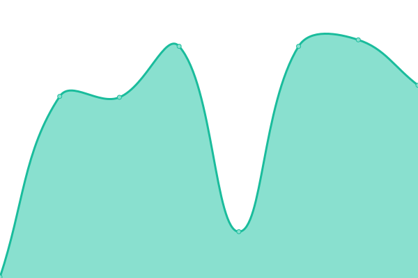

# [📈 Live Status](https://absolutelynoot.github.io/e4g01t06.monitoring): <!--live status--> **🟩 All systems operational**

This repository contains the open-source uptime monitor and status page for [absolutelynoot](https://absolutelynoot.github.io/e4g01t06.monitoring), powered by [Upptime](https://github.com/upptime/upptime).

With [Upptime](https://upptime.js.org), you can get your own unlimited and free uptime monitor and status page, powered entirely by a GitHub repository. We use [Issues](https://github.com/absolutelynoot/e4g01t06.monitoring/issues) as incident reports, [Actions](https://github.com/absolutelynoot/e4g01t06.monitoring/actions) as uptime monitors, and [Pages](https://absolutelynoot.github.io/e4g01t06.monitoring) for the status page.

<!--start: status pages-->
<!-- This summary is generated by Upptime (https://github.com/upptime/upptime) -->
<!-- Do not edit this manually, your changes will be overwritten -->
<!-- prettier-ignore -->
| URL | Status | History | Response Time | Uptime |
| --- | ------ | ------- | ------------- | ------ |
|  [E4g01t06 Jira Atlassian.net](https://e4g01t06.atlassian.net/) | 🟩 Up | [e4g01t06-jira-atlassian-net.yml](https://github.com/absolutelynoot/e4g01t06.monitoring/commits/HEAD/history/e4g01t06-jira-atlassian-net.yml) | 

 921ms
     
 | 

<a href="https://absolutelynoot.github.io/e4g01t06.monitoring/history/e4g01t06-jira-atlassian-net">100.00%</a>
    

|  [ESMOS Open Cart Production Environment](http://34.226.245.218/index.php?route=common/home) | 🟩 Up | [esmos-open-cart-production-environment.yml](https://github.com/absolutelynoot/e4g01t06.monitoring/commits/HEAD/history/esmos-open-cart-production-environment.yml) | 

 187ms
     
 | 

<a href="https://absolutelynoot.github.io/e4g01t06.monitoring/history/esmos-open-cart-production-environment">100.00%</a>
    

<!--end: status pages-->

[**Visit our status website →**](https://absolutelynoot.github.io/e4g01t06.monitoring)

## 📄 License

- Powered by: [Upptime](https://github.com/upptime/upptime)
- Code: [MIT](./LICENSE) © [absolutelynoot](https://absolutelynoot.github.io/e4g01t06.monitoring)
- Data in the `./history` directory: [Open Database License](https://opendatacommons.org/licenses/odbl/1-0/)
